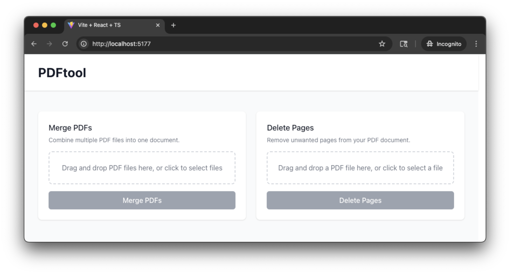
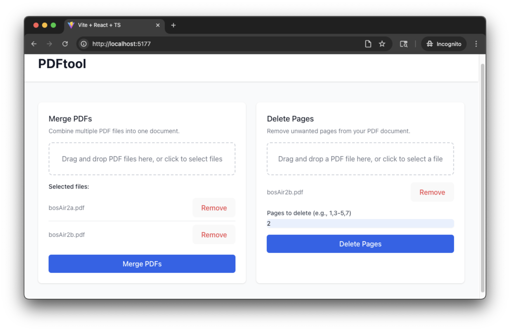

# PDF Tool

PDF Tool is an all-in-one application for manipulating PDF files. It provides a modern web interface, a REST API, and a command-line tool for merging, splitting, and managing PDF documents with ease.

## Demo


*App startup: what you see when you first open the app*


*App running: after selecting PDF files for merging and deleting pages*

A comprehensive PDF manipulation application with multiple interfaces: web-based frontend, REST API backend, and command-line interface.

## 🚀 Features

- **Merge PDFs** - Combine multiple PDF files into a single document
- **Delete Pages** - Remove specific pages or page ranges from PDFs
- **Get PDF Info** - View page count and file information
- **Multiple Interfaces** - Web UI, API, and CLI options
- **Modern UI** - Beautiful React frontend with drag-and-drop
- **Containerized** - Ready for cloud deployment

## 📁 Project Structure

```
pdftool/
├── frontend/          # React + Vite + TypeScript web application
├── backend/           # FastAPI REST API service
├── cli/              # Command-line interface
├── cloudbuild.yaml   # Google Cloud Build configuration
├── DEPLOYMENT.md     # Deployment guide
└── README.md         # This file
```

## 🛠️ Quick Start

### Option 1: Web Application (Recommended)

1. **Start the backend:**
   ```bash
   cd backend
   pip install -r requirements.txt
   python main.py
   ```

2. **Start the frontend:**
   ```bash
   cd frontend
   npm install
   npm run dev
   ```

3. **Open your browser:**
   - Frontend: http://localhost:5173 (Vite's default port)
   - Backend API: http://localhost:8000

### Option 2: Command Line Interface

```bash
cd cli
pip install -r requirements.txt
python pdf_tool.py
```

### Option 3: API Only

```bash
cd backend
pip install -r requirements.txt
python main.py
```

Then use the API endpoints directly:
- `POST /merge` - Merge multiple PDFs
- `POST /delete-pages` - Delete pages from PDF
- `GET /page-count/{filename}` - Get page count

## 🏗️ Architecture

### Frontend (React + Vite + TypeScript)
- **Framework:** React 18 with TypeScript
- **Build Tool:** Vite for fast development
- **Styling:** Tailwind CSS for modern UI
- **File Upload:** react-dropzone for drag-and-drop
- **HTTP Client:** Axios for API communication
- **Port Configuration:** Vite's default port (5173) for local development, Cloud Run handles port assignment automatically

### Backend (FastAPI + Python)
- **Framework:** FastAPI for high-performance API
- **PDF Processing:** PyPDF2 for PDF manipulation
- **Server:** Uvicorn ASGI server
- **CORS:** Configured for local development and Cloud Run deployments
- **Error Handling:** Comprehensive error responses
- **File Handling:** Streaming responses for PDF downloads
- **Environment Support:** Automatic CORS configuration for local vs. cloud environments

### CLI (Python)
- **Interface:** Command-line with interactive menu
- **PDF Processing:** Same PyPDF2 backend
- **Features:** Merge, delete pages, get info
- **Usage:** Both interactive and command-line modes

## 🚀 Deployment

### Deployment Scenarios

| Scenario | Frontend | Backend | CORS Status | Use Case |
|----------|----------|---------|-------------|----------|
| **Local Development** | `localhost:5173` | `localhost:8000` | ✅ Allowed | Development and testing |
| **Docker Local** | `localhost:80` | `localhost:8000` | ✅ Allowed | Testing production builds locally |
| **Cloud Run** | `*.run.app` | `*.run.app` | ✅ Allowed | Production deployment |

### Local Development
- Frontend: `npm run dev` (Vite's default port)
- Backend: `python main.py` (port 8000)

### Docker Deployment
```bash
# Build and run backend
docker build -t pdftool-backend ./backend
docker run -p 8000:8000 pdftool-backend

# Build and run frontend (production build)
docker build -t pdftool-frontend ./frontend
docker run -p 80:80 pdftool-frontend
```

**Note**: The frontend Docker container serves the production build (nginx on port 80), not the development server. For local development, use `npm run dev` instead of Docker.

**CORS Configuration**: The backend automatically allows requests from both local development (port 5173) and Docker deployments (port 80), as well as Cloud Run services.

### Google Cloud Run
See [DEPLOYMENT.md](DEPLOYMENT.md) for detailed cloud deployment instructions. Cloud Run automatically handles port assignment and routing.

## 📚 Documentation

- **[Frontend README](frontend/README.md)** - React application setup and usage
- **[Backend README](backend/README.md)** - FastAPI service documentation
- **[CLI README](cli/README.md)** - Command-line interface guide
- **[Deployment Guide](DEPLOYMENT.md)** - Cloud deployment instructions

## 🔧 Development

### Prerequisites
- **Python 3.8+** for backend and CLI
- **Node.js 18+** for frontend
- **Git** for version control

### Setup Development Environment
```bash
# Clone the repository
git clone <repository-url>
cd pdftool

# Backend setup
cd backend
pip install -r requirements.txt

# Frontend setup
cd ../frontend
npm install

# CLI setup
cd ../cli
pip install -r requirements.txt
```

### Running Tests
```bash
# Run all tests across the project
python run_all_tests.py

# Backend tests
cd backend
pip install -r requirements-test.txt
python -m pytest tests/ -v

# Frontend tests
cd frontend
npm install
npm run test:run

# CLI tests
cd cli
pip install -r requirements-test.txt
python -m pytest tests/ -v
```

For detailed testing information, see [TESTING.md](TESTING.md).

## 🤝 Contributing

We welcome contributions! Please see our [Contributing Guide](CONTRIBUTING.md) for details on how to submit pull requests, report issues, and contribute to the project.

This project adheres to the [Contributor Covenant Code of Conduct](CODE_OF_CONDUCT.md). By participating, you are expected to uphold this code.

### Quick Start
1. Fork the repository
2. Create a feature branch (`git checkout -b feature/amazing-feature`)
3. Commit your changes (`git commit -m 'Add amazing feature'`)
4. Push to the branch (`git push origin feature/amazing-feature`)
5. Open a Pull Request

### Development Guidelines
- Follow PEP 8 for Python code
- Use TypeScript for frontend components
- Add comprehensive error handling
- Update documentation for new features
- Test thoroughly with various PDF files

## 📄 License

This project is licensed under the Apache License, Version 2.0 - see the [LICENSE](LICENSE) file for details.

## 🐛 Troubleshooting

### Common Issues

1. **Port conflicts:**
   ```bash
   # Kill processes using ports
   lsof -i :8000 | grep LISTEN | awk '{print $2}' | xargs kill -9
   lsof -i :5173 | grep LISTEN | awk '{print $2}' | xargs kill -9
   ```

2. **Frontend build errors:**
   ```bash
   cd frontend
   rm -rf node_modules package-lock.json
   npm install
   ```

3. **Backend dependency issues:**
   ```bash
   cd backend
   pip install --upgrade pip
   pip install -r requirements.txt
   ```

4. **PDF processing errors:**
   - Ensure files are valid PDFs
   - Check file permissions
   - Verify file size limits

### Getting Help
- Check the individual component READMEs
- Review the API documentation at http://localhost:8000/docs
- Check the deployment guide for cloud issues

## 📈 Roadmap

- [ ] Add PDF compression feature
- [ ] Implement PDF rotation and scaling
- [ ] Add watermark functionality
- [ ] Create mobile-responsive web app
- [ ] Add batch processing capabilities
- [ ] Implement user authentication
- [ ] Add file storage and sharing
- [ ] Create plugin system for custom operations

## 🙏 Acknowledgments

- **PyPDF2** for PDF manipulation capabilities
- **FastAPI** for the excellent web framework
- **React** and **Vite** for the modern frontend experience
- **Tailwind CSS** for the beautiful UI components

## 🆘 Support

For questions, issues, or feature requests, please open an issue on the [GitHub repository](https://github.com/wescpy/pdftool/issues) or contact the maintainer. 